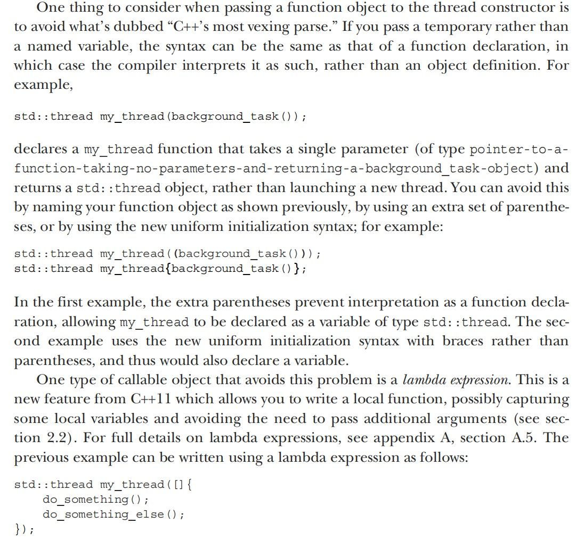
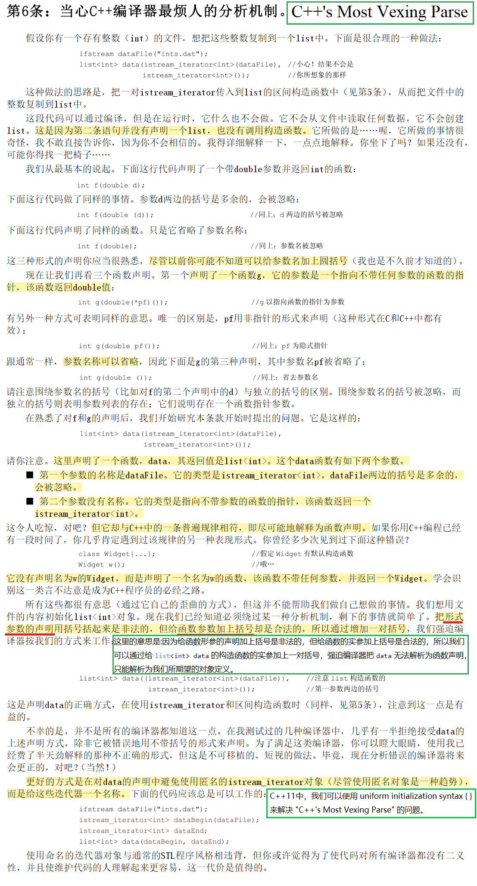

# Most Vexing Parse

**The main reason for "Most Vexing Parse" is that between declaring an object and declaring a function, C++ grammar rules prefer to parse it as a function declaration.**

## [Is there any difference between List x; and List x();? (isocpp.org)](https://isocpp.org/wiki/faq/ctors#empty-parens-in-object-decl)

A *big* difference!

Suppose that `List` is the name of some class. Then function `f()` declares a local `List` object called `x`:

```cpp
void f()
{
  List x;     // Local object named x (of class List)
  // ...
}
```

But function `g()` declares a function called `x()` that returns a `List`:

```cpp
void g()
{
  List x();   // Function named x (that returns a List)
  // ...
}
```


## [Why am I getting an error after declaring a Foo object via Foo x(Bar())? (isocpp.org)](https://isocpp.org/wiki/faq/ctors#fn-decl-vs-obj-instantiation)

Because that doesn’t create a `Foo` object - it declares a non-member function that *returns* a `Foo` object. The term “Most Vexing Parse” was coined by Scott Myers to describe this situation.

This is really going to hurt; you might want to sit down.

First, here’s a better explanation of the problem. Suppose there is a class called `Bar` that has a default ctor. This might even be a library class such as `std::string`, but for now we’ll just call it `Bar`:

```cpp
class Bar {
public:
  Bar();
  // ...
};
```

Now suppose there’s another class called `Foo` that has a ctor that takes a `Bar`. As before, this might be defined by someone other than you.

```cpp
class Foo {
public:
  Foo(const Bar& b);  // or perhaps Foo(Bar b)
  // ...
  void blah();
  // ...
};
```

Now you want to create a `Foo` object using a temporary `Bar`. In other words, you want to create an object via `Bar()`, and pass that to the `Foo` ctor to create a local `Foo` object called `x`:

```cpp
void yourCode()
{
  Foo x(Bar());  // You think this creates a Foo object called x...
  x.blah();      // ...But it doesn't, so this line gives you a bizarre error message
  // ...
}
```

It’s a long story, but one solution (hope you’re sitting down!) is to add an extra pair of `()`s around the `Bar()` part:

```cpp
void yourCode()
{
  Foo x((Bar()));
        ↑     ↑ // These parens save the day
  x.blah();
  ↑↑↑↑↑↑↑↑ // Ahhhh, this now works: no more error messages
  // ...
}
```

Another solution is to use `=` in your declaration (see the fine print below):

```cpp
void yourCode()
{
  Foo x = Foo(Bar());  // Yes, Virginia, that thar syntax works; see below for fine print
  x.blah();            // Ahhhh, this now works: no more error messages
  // ...
}
```

*Note:* The above solution requires `yourCode()` to be able to access the `Foo` copy constructor. In most situations that means the `Foo` copy constructor needs to be `public`, though it needn’t be `public` in the less common case where `yourCode()` is a [friend](https://isocpp.org/wiki/faq/friends) of `class Foo`. If you’re not sure what any of that means, try it: if your code compiles, you passed the test.

Here’s another solution (more fine print below):

```cpp
void yourCode()
{
  Foo x = Bar();  // Usually works; see below for fine print on "usually"
  x.blah();
  // ...
}
```

*Note:* The word “usually” in the above means this: the above fails only when `Foo::Foo(const Bar&)` [constructor is `explicit`](https://isocpp.org/wiki/faq/ctors#explicit-ctors), or when `Foo`’s copy constructor is inaccessible (typically when it is `private` or `protected`, and your code is not a `friend`). If you’re not sure what any of that means, take 60 seconds and compile it. You are guaranteed to find out whether it works or fails at compile-time, so if it compiles cleanly, it will work at runtime.

However, the *best* solution, the creation of which was at least partially motivated by the fact that this FAQ exists, is to use [uniform initialization](https://isocpp.org/wiki/faq/cpp11-language#uniform-init), which replaces the `()` around the `Bar()` call with `{}` instead.

```cpp
void yourCode()
{
  Foo x{Bar()};  
  x.blah();      // Ahhhh, this now works: no more error messages
  // ...
}
```

That’s the end of the solutions; the rest of this is about *why* this is needed (this is optional; you can skip this section if you don’t care enough about your career to actually understand what’s going on; ha ha): When the compiler sees `Foo x(Bar())`, it thinks that the `Bar()` part is declaring a non-member function that returns a `Bar` object, so it thinks you are declaring the existence of a *function* called `x` that returns a `Foo` and that takes as a single parameter of type “non-member function that takes nothing and returns a `Bar`.”

Now here’s the sad part. In fact it’s pathetic. Some mindless drone out there is going to skip that last paragraph, then they’re going to impose a bizarre, incorrect, irrelevant, and just plain *stupid* coding standard that says something like, “Never create temporaries using a default constructor” or “Always use `=` in all initializations” or something else equally inane. If that’s you, please fire yourself before you do any more damage. Those who don’t *understand the problem* shouldn’t tell others how to solve it. Harumph.

(That was mostly tongue in cheek. But there’s a grain of truth in it. The real problem is that people tend to worship consistency, and they tend to extrapolate from the obscure to the common. That’s not wise.)


## [C++'s most vexing parse (CPP-Concurrency-In-Action-2ed-2019/2.1.1-chinese.md)](https://github.com/xiaoweiChen/CPP-Concurrency-In-Action-2ed-2019/blob/master/content/chapter2/2.1-chinese.md)



## [Effective STL Item 06:Be alert for C++'s most vexing parse.](https://www.cnblogs.com/ltimaginea/p/15906739.html)



## References

- [Is there any difference between List x; and List x();? (isocpp.org)](https://isocpp.org/wiki/faq/ctors#empty-parens-in-object-decl)
- [Why am I getting an error after declaring a Foo object via Foo x(Bar())? (isocpp.org)](https://isocpp.org/wiki/faq/ctors#fn-decl-vs-obj-instantiation)
- [C++'s most vexing parse (CPP-Concurrency-In-Action-2ed-2019/2.1.1-chinese.md)](https://github.com/xiaoweiChen/CPP-Concurrency-In-Action-2ed-2019/blob/master/content/chapter2/2.1-chinese.md)
- [Effective STL Item 06:Be alert for C++'s most vexing parse.](https://www.cnblogs.com/ltimaginea/p/15906739.html)
- [ES.23: Prefer the {}-initializer syntax (C++ Core Guidelines)](http://isocpp.github.io/CppCoreGuidelines/CppCoreGuidelines#Res-list)
- [Item 7: Distinguish between () and {} when creating objects · EffectiveModernCppChinese · GitHub](https://github.com/kelthuzadx/EffectiveModernCppChinese/blob/master/3.MovingToModernCpp/item7.md)

