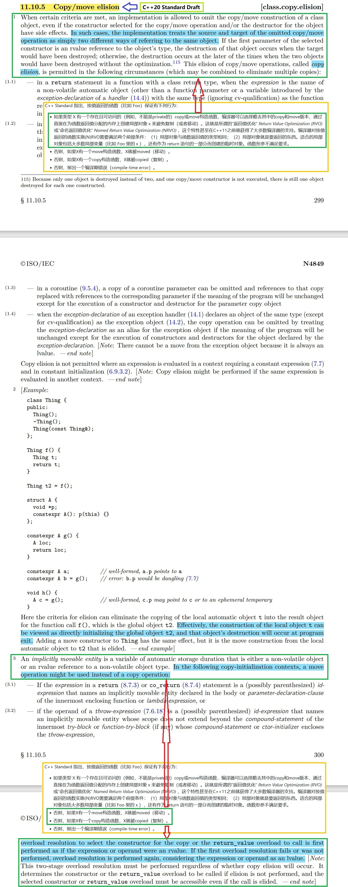

# Copy/move elision

C++ Standard Drafts 见 [C++ - Standards (open-std.org)](http://www.open-std.org/JTC1/SC22/WG21/docs/standards) 。

C++11 Standard Draft 中关于 Copy/move elision 的解释，见其 12.8 Copying and moving class objects 节的 32, 33 段落。

C++14 Standard Draft 中关于 Copy/move elision 的解释，见其 12.8 Copying and moving class objects 节的 31, 32 段落。

C++17 Standard Draft 中关于 Copy/move elision 的解释，见其 15.8.3 Copy/move elision 节。

C++20 Standard Draft 中关于 Copy/move elision 的解释，见其 11.10.5 Copy/move elision 节，C++20 Standard Draft 中其截图和相关备注如下：

