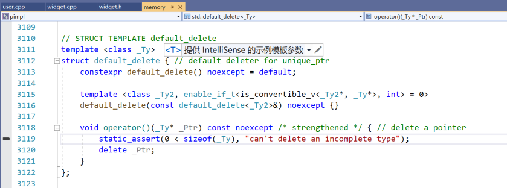

# *条款 22：使用 Pimpl习惯用法时，将特殊成员函数的定义放到实现文件中*

## Pimpl

"Pimpl" 意为 "Pointer to implementation" ，即 “指向实现的指针”。

"Pimpl" 是一种 C++ 编程技巧，它将类的实现细节从对象表示中移除，放到一个分离的类中，并以一个不透明的指针进行访问。此技巧用于构造拥有稳定 ABI 的 C++ 库接口，及减少编译时依赖。


`interface (Ch13_00_pimpl_widget.h)`

```cpp
#pragma once
#include <memory>

class Widget
{
public:
	Widget(int i = 0);
	Widget(const Widget&);
	Widget(Widget&&);
	Widget& operator=(const Widget&);
	Widget& operator=(Widget&&);
	~Widget();
public:
	void PrintInfo();
	// ...
private:
	// things to be hidden go here
	class Impl;
	// opaque pointer to forward-declared class
	std::unique_ptr<Impl> pimpl_;
};

// Tips:
//	1. 对于 std::unique_ptr 而言，删除器的类型是智能指针类型的一部分
//	2. 对于 std::shared_ptr 而言，删除器的类型并非智能指针类型的一部分
```


`implementation (Ch13_00_pimpl_widget.cpp)`

```cpp
#include <iostream>
#include <string>
#include <vector>
#include <utility>

#include "Ch13_00_pimpl_widget.h"
//#include "gadget.h"

class Widget::Impl
{
public:
	Impl(int i = 0) : i_(i) {  }
public:
	int GetInfo() { return i_; }
private:
	std::string name_;
	std::vector<double> data_;
	int i_;
	// ...
};

Widget::Widget(int i) : pimpl_(std::make_unique<Impl>(i))
{

}

Widget::Widget(const Widget& rp) : pimpl_(rp.pimpl_ ? std::make_unique<Impl>(*rp.pimpl_) : nullptr)
{

}

// 编译器合成的移动操作完全符合预期，所以我们使用 =default 来由编译器合成移动构造函数。
// 因为头文件 Ch13_00_pimpl_widget.h 中声明的移动构造函数未标记为 noexcept ，
// 所以编译器为使移动构造函数的声明和实现的“异常说明”一致，此例的合成移动构造函数将不会是 noexcept 。这算是Pimpl技术的一个缺点吧。
Widget::Widget(Widget&&) = default;

Widget& Widget::operator=(const Widget& rp)
{
	pimpl_ = rp.pimpl_ ? std::make_unique<Impl>(*rp.pimpl_) : nullptr;
	return *this;
}

// 编译器合成的移动操作完全符合预期，所以我们使用 =default 来由编译器合成移动赋值运算符。
// 因为头文件 Ch13_00_pimpl_widget.h 中声明的移动赋值运算符未标记为 noexcept ，
// 所以编译器为使移动赋值运算符的声明和实现的“异常说明”一致，此例的合成移动赋值运算符将不会是 noexcept 。这算是Pimpl技术的一个缺点吧。
Widget& Widget::operator=(Widget&&) = default;

Widget::~Widget() = default;

void Widget::PrintInfo()
{
	std::cout << pimpl_->GetInfo() << std::endl;
}

// Tips:
//	1. 对于 std::unique_ptr 而言，删除器的类型是智能指针类型的一部分
//	2. 对于 std::shared_ptr 而言，删除器的类型并非智能指针类型的一部分
//	3. 编译器合成的移动操作完全符合预期，即针对 std::unique_ptr 执行移动操作，所以我们可以使用 =default 来让编译器生成合成版本的移动操作

```


`user (Ch13_00_pimpl_user.cpp)`

```cpp
#include <iostream>
#include <vector>
#include <type_traits>

#include "Ch13_00_pimpl_widget.h"

int main()
{
	// 分别输出 false	false
	std::cout << std::boolalpha << std::is_nothrow_move_constructible<Widget>::value << std::noboolalpha << std::endl;
	std::cout << std::boolalpha << std::is_nothrow_move_assignable<Widget>::value << std::noboolalpha << std::endl;

	Widget w1(1);
	Widget w2(w1);
	Widget w3 = std::move(w1);
	Widget w4(4);
	w1 = w4;
	Widget w5(5);
	Widget w6(6);
	w5 = std::move(w5);
	w6 = w1;
	w6 = std::move(w1);
	w6 = w1;
	Widget w7(w1);
	w1 = w2;
	w6 = w2;
	w7 = w2;

	w1.PrintInfo();
	w2.PrintInfo();
	w3.PrintInfo();
	w4.PrintInfo();
	w5.PrintInfo();
	w6.PrintInfo();
	w7.PrintInfo();

	{
		Widget w1(11);
		Widget w2(22);
		Widget w3(33);
		Widget w4(44);
		std::vector<Widget> v;
		// 注释掉下面这句，便可以观察到vector重新分配内存的过程中，使用拷贝构造函数复制旧元素至新内存，因为类Widget的合成移动构造函数是可能抛异常的
		//v.reserve(10);
		v.push_back(std::move(w1));
		v.push_back(std::move(w2));
		v.push_back(std::move(w3));
		v.push_back(std::move(w4));
	}

	return 0;
}

```


## Explanation

一个已声明但未定义的类型称为不完整类型。

因为类的私有数据成员参与其对象表示，影响大小和布局，也因为类的私有成员函数参与[重载决议](https://zh.cppreference.com/w/cpp/language/overload_resolution)（这发生于成员访问检查之前），故对实现细节的任何更改都要求该类的所有用户重编译。

Pimpl 打破了这种编译依赖；实现的改动不会导致重编译。结果是，若某个库在其 ABI 中使用 Pimpl，则这个库的新版本可以更改实现，并且与旧版本保持 ABI 兼容。所以它通常被称为“编译防火墙”(Compilation firewall) 。

在这里我把`#include`命令写出来是为了明确一点，对于`std::string`，`std::vector`和`gadget`的头文件的总体依赖依然存在。 然而，这些依赖从头文件`widget.h`（它被所有`Widget`类的用户(Users)包含，并且对他们可见）移动到了`widget.cpp`（该文件只被`Widget`类的实现者(Implementer)包含，并只对他可见）。

对于该示例，经过使用 Visual Studio 2019 和 g++ 9.3.0 测试，发现合成的移动操作并未标记为 `noexcept` ，推测原因为：因为头文件中声明的移动操作未标记为 `noexcept` ，所以当我们在实现文件中使用 `=default` 来由编译器合成移动操作时，编译器为使移动操作的声明和实现的“异常说明”一致，合成的移动操作将不会是 `noexcept` 的。这算是Pimpl技术的一个缺点吧。这时可能会问，为何我们不同时在头文件和实现文件中对使用了 `=default` 的移动操作手动添加“异常说明”呢？事实上我们不应该这样做。当我们使用 `=default` 来由编译器合成特殊成员函数时，不需要也不应该同时再手动添加“异常说明”，因为编译器总是做得更好，更有可能生成正确的“异常说明”，而如果我们手动添加了“异常说明”，那么也就阻止了编译器生成更有可能正确的“异常说明”了。详见：[Ch13_01_default_delete.md](../Ch13_01_default_delete/Ch13_01_default_delete.md#default) 。


## Implementation

优先使用 std::unique_ptr 来保存 pimpl_ 。它比使用 std::shared_ptr 更有效，并且正确表达了不应共享 pimpl_ 对象的意图。

**因为 [std::unique_ptr](https://zh.cppreference.com/w/cpp/memory/unique_ptr) 要求被指向类型在任何实例化删除器的语境中均为完整类型，故所有特殊成员函数必须被用户在头文件 `widget.h` 中声明，且在实现文件 `widget.cpp` 内定义之，位置在 *Widget::Impl* 定义之后**。 

所以，我们不能在头文件中对类特殊成员函数使用 `default` ，因为编译器产生的特殊成员函数，基本上是隐式 `inline` 的。同时，对于类的复制操作，我们需要自己编写这些特殊成员函数，原因是：（1）因为类Widget存在 只移型成员 unique_ptr pimpl_ ，所以编译器无法生成复制操作。（2）即使编译器可以生成复制操作，其也是浅拷贝，而不是我们期望的深拷贝。

然而，值得注意的是，如果我们使用 std::shared_ptr 而不是 std::unique_ptr 来做 pimpl_ 指针， 我们会发现本条款的建议不再适用。 std::unique_ptr 和 std::shared_ptr 在 pimpl_ 指针上的表现上的区别的深层原因在于，他们支持自定义删除器的方式不同。 对 std::unique_ptr 而言，删除器的类型是这个智能指针的一部分，这让编译器有可能生成更小的运行时数据结构和更快的运行代码。 这种更高效率的后果之一就是 std::unique_ptr 指向的类型，在编译器的生成特殊成员函数（如析构函数，移动操作）被调用时，必须已经是一个完整类型。 而对 std::shared_ptr 而言，删除器的类型不是该智能指针的一部分，这让它会生成更大的运行时数据结构和稍微慢点的代码，但是当编译器生成的特殊成员函数被使用的时候，指向的对象不必是一个完整类型。

对于Pimpl 习惯用法而言，并不需要在 std::unique_ptr 和 std::shared_ptr 的特性之间做出权衡。 因为对于Widget类和Widget::Impl类 之间的关系而言，他们是专属所有权关系，这让 std::unique_ptr 使用起来很合适。 然而，有必要知道，在其他情况中，当共享所有权存在时，std::shared_ptr 是很适用的选择的时候，就没有 std::unique_ptr 所必需的声明——定义（function-definition）这样的麻烦事了。


*Prefer to hold the Pimpl using a unique_ptr . It’s more efficient than using a shared_ptr, and correctly expresses the intent that the Pimpl object should not be shared.*

*Define and use the Pimpl object in your own implementation file. This is what keeps its details hidden.*

*In the visible class’ out-of-line constructor, allocate the Pimpl object.*

*Although both unique_ptr and shared_ptr can be instantiated with an incomplete type, but unique_ptr’s destructor requires a complete type in order to invoke delete (unlike shared_ptr which captures more information when it’s constructed).*

***Because std::unique_ptr requires that the pointed-to type is a complete type in any context where the deleter is instantiated, the special member functions must be user-declared and defined out-of-line, in the implementation file, where Widget::Impl is already defined.***

*The above pattern does not make the visible class either copyable or movable by default, because C++11 is less eager to have the compiler generate default copying and moving operations for you. Because we’ve had to write a user-defined destructor, that turns off the compiler-generated move constructor and move assignment operator. If you do decide to supply copy and/or move, note that the copy assignment and move assignment operator need to be defined out of line in the implementation class for the same reason as the destructor.*





## References

- [Effective-Modern-Cpp/Item22_pimpl.md at main · ltimaginea/Effective-Modern-Cpp · GitHub](https://github.com/ltimaginea/Effective-Modern-Cpp/blob/main/EffectiveModernCpp/Content/Item22_pimpl.md)
- [I.27: For stable library ABI, consider the Pimpl idiom (CppCoreGuidelines)](https://github.com/isocpp/CppCoreGuidelines/blob/master/CppCoreGuidelines.md#Ri-pimpl)
- [PImpl - cppreference.com](https://en.cppreference.com/w/cpp/language/pimpl)
- [GotW #100: Compilation Firewalls (Difficulty: 6/10) – Sutter’s Mill (herbsutter.com)](https://herbsutter.com/gotw/_100/)
- [EffectiveModernCppChinese/item22.md at master · kelthuzadx/EffectiveModernCppChinese · GitHub](https://github.com/kelthuzadx/EffectiveModernCppChinese/blob/master/4.SmartPointers/item22.md)

