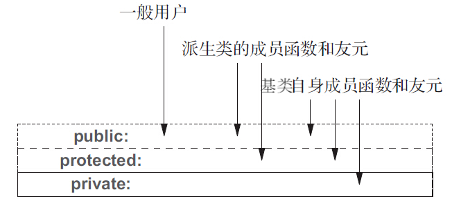

# Access Control and Inheritance

## Access Specifiers

公有成员（public member） ：能够被类的所有用户访问。

保护成员（protected member） ：能够被派生类的成员和友元访问（Tip: regardless of whether the members are on the same or different instances.） ：

- 保护成员对于派生类的成员和友元来说是可访问的，但对于类的普通用户来说是不可访问的。
- 派生类的成员和友元只能访问派生类对象中的基类部分的受保护成员；对于普通的基类对象中的成员不具有特殊的访问权限。（Tip: 按理说，基类的成员和友元对于普通的派生类对象，也应该是不具有特殊的访问权限的。但经过测试发现，对于 `protected` 或 `private` 继承的方式，基类的成员和友元是符合预期地仅可以访问普通派生类对象自定义部分的 `public` 成员；但是对于 `public` 继承的方式，基类的成员和友元是出乎预期地既可以访问普通派生类对象自定义部分的 `public` 成员，还可以访问普通派生类对象继承自基类部分的所有成员，见本文最后的示例程序。）

私有成员（private member） ：只能被类的成员和友元访问（Tip: regardless of whether the members are on the same or different instances.）。

`public` ， `protected` 和 `private` 三类关键字在类中出现的次数和先后次序都没有限制。成员的可访问性由离它前面最近的那个访问说明符决定。如果某个成员前面没有访问说明符，则对 class 来说，该成员默认是 `private` 成员；对 struct 来说，该成员默认是 `public` 成员。



## Access Control with Inheritance

C++ 中存在公有继承、受保护继承和私有继承的三种继承方式。

某个类对其继承而来的成员的访问权限受到两个因素影响：一是在基类中该成员的访问说明符，二是在派生类的派生列表中的访问说明符。

**派生访问说明符**对于派生类的成员（及友元）能否访问其**直接基类**的成员没什么影响，对其直接基类的成员的访问权限只与基类中的访问说明符有关（但是，**间接基类**不同，即一个派生类能否访问其间接基类的成员，会受影响于该派生类的直接基类是以何种方式继承该派生类的间接基类的，详见下一段，示例程序见 [Ch15_05_AccessControl_InheritanceHierarchy.cpp](./Ch15_05_AccessControl_InheritanceHierarchy.cpp) ）。

**派生访问说明符**的目的是控制派生类用户（包括派生类的派生类在内，示例程序见 [Ch15_05_AccessControl_InheritanceHierarchy.cpp](./Ch15_05_AccessControl_InheritanceHierarchy.cpp) ）对于基类成员的访问权限：

- 公有继承（public inheritance）： 在公有继承中，基类的成员将遵循其原有的访问说明符 成为派生类的成员。
- 受保护的继承（protected inheritance）： 在受保护的继承中，基类的公有成员和受保护成员会成为派生类的受保护成员。
- 私有继承（private inheritance）： 在私有继承中，基类的公有成员和受保护成员会成为派生类的私有成员。

|              | 派生类对象 | 派生类对象 | 派生类对象 |
| :----------: | :--------: | :--------: | :--------: |
| **基类成员** |  公有继承  |  保护继承  |  私有继承  |
|   公有成员   |    公有    |    保护    |    私有    |
|   保护成员   |    保护    |    保护    |    私有    |
|   私有成员   |  不可访问  |  不可访问  |  不可访问  |

基类的私有成员在派生类中成为不可访问成员，只能通过基类的成员和友元间接访问。

默认情况下，使用 class 关键字定义的派生类是 `private` 继承的；而使用 struct 关键字定义的派生类是 `public` 继承的。

```cpp
class Base { /* ... */ };
struct D1 : Base { /* ... */ };	// 默认 public 继承
class D2 : Base { /* ... */ };	// 默认 private 继承
```


## Class Design

我们可以认为一个类有两种不同的用户：普通用户（user）和类的实现者（author）。普通用户编写的代码使用类的对象；类的实现者则负责编写类的成员和友元的代码。

- 普通用户：不考虑继承的话，普通用户只能访问类的公有（接口）成员；考虑继承的话，普通用户仍旧只能访问派生类的公有（接口）成员。
- 类的实现者：不考虑继承的话，类的实现者可以访问类的所有成员；考虑继承的话，派生类的实现者既可以访问派生类自定义部分的所有成员，还可以访问继承自基类部分的 `protected` 成员和 `public` 成员（Tip: regardless of whether the members are on the same or different instances.）。

综上，类成员对于调用者来说是否可访问，我们一方面要观察当前调用者是什么类型的用户，另一方面要观察当前调用者的表达式所处的上下文环境。

> *Cpp Primer*
>
> 关键概念：类的设计与受保护的成员 
>
> 不考虑继承的话，我们可以认为一个类有两种不同的用户：普通用户和类的实现者。其中，普通用户编写的代码使用类的对象，这部分代码只能访问类的公有（接口）成员；实现者则负责编写类的成员和友元的代码，成员和友元既能访问类的公有部分，也能访问类的私有（实现）部分。 
>
> 如果进一步考虑继承的话就会出现第三种用户，即派生类。基类把它希望派生类能够使用的部分声明成受保护的。普通用户不能访问受保护的成员，而派生类及其友元仍旧不能访问私有成员。 
>
> 和其他类一样，基类应该将其接口成员声明为公有的；同时将属于其实现的部分分成两组：一组可供派生类访问，另一组只能由基类及基类的友元访问。对于前者应该声明为受保护的，这样派生类就能在实现自己的功能时使用基类的这些操作和数据；对于后者应该声明为私有的。


示例程序：（需要留意基类 Base 的成员函数 Base::F 对普通的派生类对象的成员的访问权限）

```cpp
#include <iostream>

class S
{
public:
	S() : n_(10) {  }
	// regardless of whether the members are on the same or different instances
	S(const S& other) : n_(other.n_) {  }	// other.n is accessible in S::S
private:
	int n_;
};

class Derived;

class Base
{
public:
	virtual ~Base() = default;
	void F(Base&, Derived&);
public:
	int public_;
protected:
	int protected_;
private:
	int private_;
};

//class Derived : private Base
//class Derived : protected Base
class Derived : public Base
{
public:
	void Access(Derived& d)
	{
		public_ = 1;			// OK
		protected_ = 1;			// OK，访问从基类继承的 protected 成员
		//private_ = 1;			// 错，不能访问基类私有成员
		d_public_ = 1;			// OK
		d_protected_ = 1;		// OK
		d_private_ = 1;			// OK

		d.public_ = 1;			// OK
		// regardless of whether the members are on the same or different instances
		d.protected_ = 1;		// OK
		//d.private_ = 1;		// 错
		d.d_public_ = 1;		// OK
		// regardless of whether the members are on the same or different instances
		d.d_protected_ = 1;		// OK
		// regardless of whether the members are on the same or different instances
		d.d_private_ = 1;		// OK

		Base f;
		f.public_ = 1;			// OK
		//f.protected_ = 1;		// 错，在派生类的成员函数中不能访问普通的基类对象的保护成员
		//f.private_ = 1;		// 错
	}
public:
	int d_public_;
protected:
	int d_protected_;
private:
	int d_private_;
};

void Base::F(Base& b, Derived& d)
{
	++protected_;

	// regardless of whether the members are on the same or different instances
	++b.private_;
	++b.protected_;
	++b.public_;

	++d.public_;		// 经过测试发现仅公有继承时才可以访问该成员
	++d.protected_;		// 经过测试发现仅公有继承时才可以访问该成员
	++d.private_;		// 经过测试发现仅公有继承时才可以访问该成员
	++d.d_public_;
	//++d.d_protected_;
	//++d.d_private_;
}

// non-member/non-friend
void X(Base& b, Derived& d)
{
	//++b.protected_;	// error: no access from non-member/non-friend
	//++d.protected_;	// error: no access from non-member/non-friend
}

int main()
{
	Base b;
	Derived d;
	//int n = b.protected_;		// 错，在类的成员函数外部，不能访问基类保护成员
	//n = d.private_;			// 错，此处不能访问d的私有成员
	d.public_ = 10;				// 仅公有继承时可以访问
	d.d_public_ = 11;			// OK

	return 0;
}

// Tips:
// 1. 在类的成员函数内部可以访问同类其他对象的全部(私有, 保护, 公有)成员(不含继承的基类的私有成员，其是不可访问的)。
// 2. 需要留意基类Base的成员函数Base::F对普通的派生类对象的成员的访问权限：
// 按理说，基类的成员和友元对于普通的派生类对象，也应该是不具有特殊的访问权限的。
// 但经过测试发现，对于protected或private继承的方式，基类的成员和友元是符合预期地仅可以访问普通派生类对象自定义部分的public成员；
// 但是对于public继承的方式，基类的成员和友元是出乎预期地既可以访问普通派生类对象自定义部分的public成员，还可以访问普通派生类对象继承自基类部分的所有成员。

```


## References

- [Access specifiers - cppreference.com](https://en.cppreference.com/w/cpp/language/access)
- [Derived classes - cppreference.com](https://en.cppreference.com/w/cpp/language/derived_class)
- [What are the access rules with private and protected inheritance?, C++ FAQ (isocpp.org)](https://isocpp.org/wiki/faq/private-inheritance#access-rules-with-priv-inherit)
- [Member Access Control (C++) | Microsoft Docs](https://docs.microsoft.com/en-us/cpp/cpp/member-access-control-cpp?view=msvc-170)
- [类成员的访问范围说明符_ltimaginea的博客-CSDN博客](https://blog.csdn.net/sinat_43125576/article/details/109106282)
- [不同派生方式下基类成员在派生类中的可访问范围属性_ltimaginea的博客-CSDN博客](https://blog.csdn.net/sinat_43125576/article/details/109250948)
- [虚函数的访问权限_ltimaginea的博客-CSDN博客](https://blog.csdn.net/sinat_43125576/article/details/110359051)

