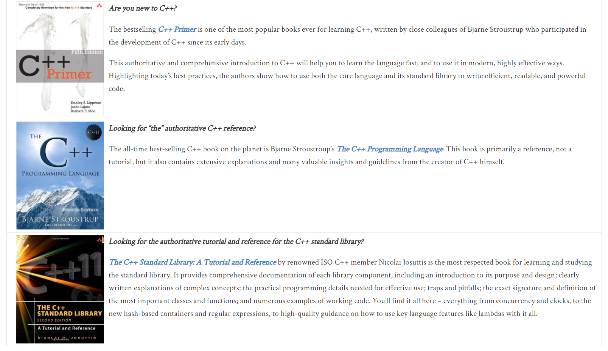

# Cpp-Primer

## Learning Suggestions to Beginners of C++

"I think for a beginner, the most important thing is don't try and learn it all at once. No modern language you can just learn everything and then start using it. You have to think about what you need. You have to start with the fundamentals with the things that are relatively simple. So actually for C++, you should learn the modern part first, and leaving some of the old fashion stuff to later. But people often do the exact opposite in practice." -- Bjarne Stroustrup

## Web Resources

- [Standard C++ (isocpp.org)](https://isocpp.org/)
- [C++ Standard Drafts (open-std.org)](http://www.open-std.org/JTC1/SC22/WG21/docs/standards)
- [C++ Reference](http://en.cppreference.com/w/): A site with its main focus on a complete Standard Template Library reference, the Technical Specifications, and a list of selected non-ANSI/ISO libraries. An [offline archive](http://en.cppreference.com/w/Cppreference:Archives) is available.
- [cplusplus.com](http://www.cplusplus.com/): A site with general information about the C++ language, a reference, tutorial, and an articles section.
- [C++ docs - get started, tutorials, reference. | Microsoft Learn](https://learn.microsoft.com/en-us/cpp/cpp/) 
- [C++ Core Guidelines (isocpp.github.io)](http://isocpp.github.io/CppCoreGuidelines/CppCoreGuidelines)
- [Google C++ Style Guide](https://google.github.io/styleguide/cppguide.html)
- [LLVM Coding Standards](https://llvm.org/docs/CodingStandards.html)
- [GDB online Debugger](https://www.onlinegdb.com)
- [Compiler Explorer (godbolt.org)](https://godbolt.org/)
- [C++ Insights](https://cppinsights.io)

## Great Books for Learning C++

Here are three great books for learning C++ – whether you know C++ already or not, and whether you even know how to program in any language or not, you’ll find the book that’s right for you.

